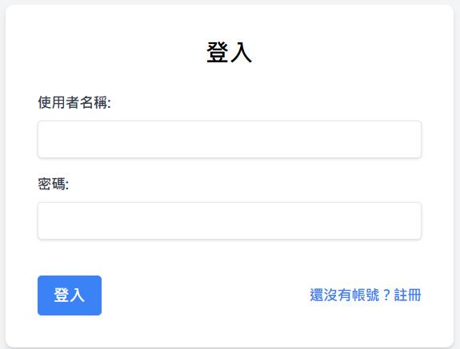
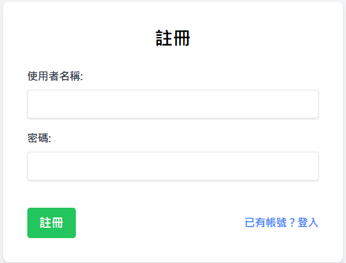
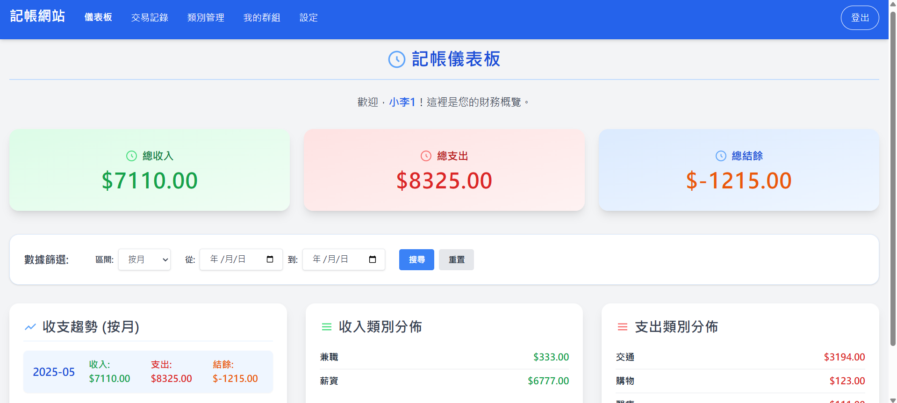
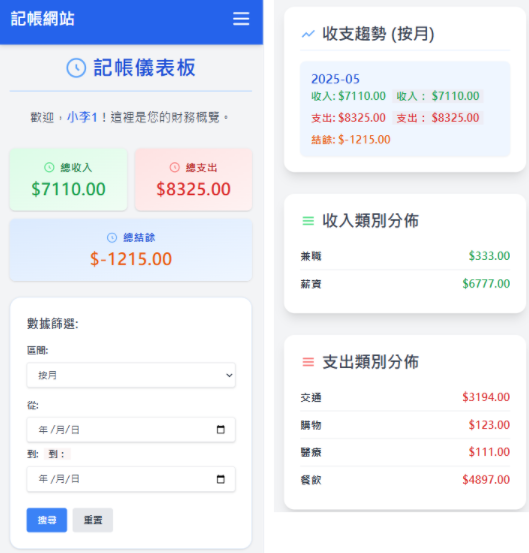
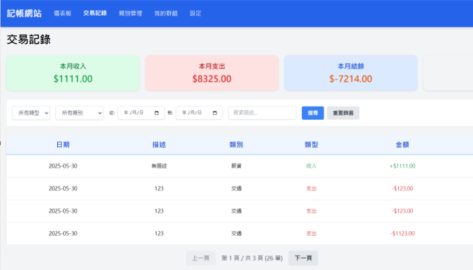
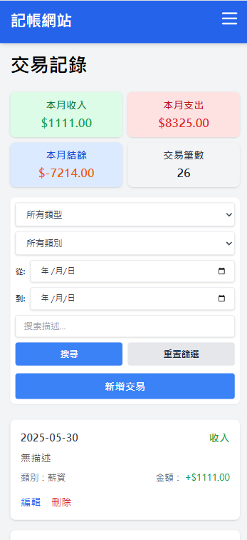
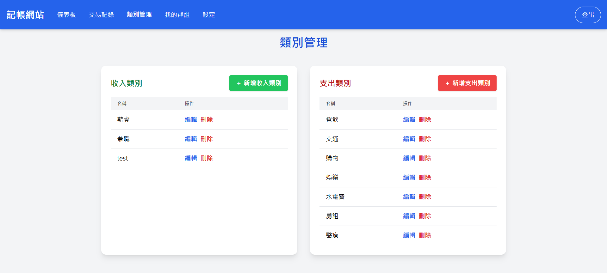
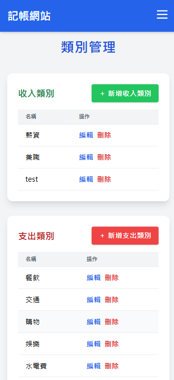
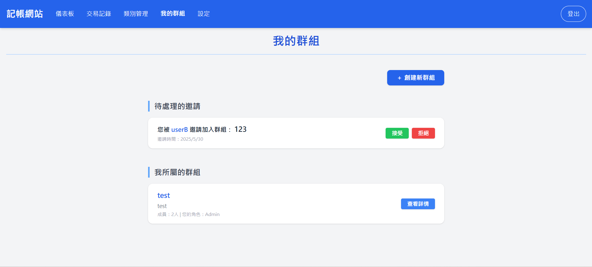
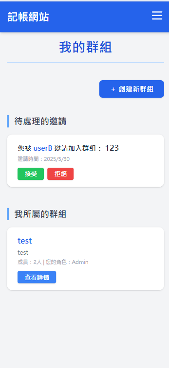

# 記帳網站 (Accounting Web App)

一個功能豐富、支援個人與群組的記帳 Web 應用程式，旨在幫助使用者輕鬆追蹤與分析收支。

本專案具備強大的多條件篩選、分頁、自定義類別管理、協作式群組記帳、即時通知，並採用響應式設計與現代化 UI/UX，確保在任何裝置上都能提供流暢的體驗。

🔗 **網站連結：** [https://yahoo0976095579.github.io/Accounting-website/](https://yahoo0976095579.github.io/Accounting-website/)

## 🛠️ 使用技術

- **前端**：Vue 3, Vite, Tailwind CSS
- **後端**：Python, Flask
- **資料庫**：PostgreSQL
- **部署**：Vercel (前端), Render (後端 & 資料庫)

## ✨ 主要功能亮點

### 🔐 安全使用者認證

- 完整的註冊、登入、登出流程
- JWT 身份驗證，確保 API 請求安全
- JWT 過期自動登出並導回登入頁面

### 🧾 個人記帳

- 交易 CRUD 操作
- 多條件篩選與分頁
- 即時更新統計與交易列表

### 👥 協作式群組記帳

- 群組建立/解散、成員管理與邀請
- 可重複邀請、權限管理、智能退出
- 群組內共享交易，支援篩選與分頁

### 📊 儀表板

- 收支與結餘概覽
- 趨勢圖表（日/週/月）
- 類別分佈視覺化分析

### 🗂 類別管理

- 自定義收支類別

### 🔔 即時通知與提示

- 全局非阻斷式提示 (成功/錯誤/過期等)
- 載入動畫與確認刪除彈窗

### 📱 響應式設計

- 支援桌機與手機
- 卡片模式表格、按鈕與欄位優化

### 🎨 現代化介面

- 使用 Tailwind CSS 打造簡潔美觀 UI

---

## 📸 畫面預覽

### 登入與註冊

### 首頁

### 交易紀錄

### 類別管理

### 群組記帳

