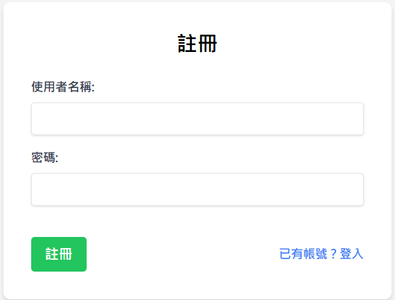

# 💸 記帳網站 (Accounting Web App)

一個功能豐富、支援個人與群組的記帳 Web 應用程式，幫助使用者輕鬆追蹤與分析收支。具備多條件篩選、分頁、類別管理、群組協作、即時通知、響應式設計與現代化 UI/UX。

測試使用 Vue + python flask + sqlite 完成
部屬使用 Vercel 部屬前端，後端用 Render，資料庫用 Render 內的 postgresql

網站網址為:https://accounting-website-j8a3.vercel.app/
(最下方有預覽圖片)

---

## ✨ 主要功能

- **使用者認證**：註冊、登入、登出，安全的會話管理。
- **個人記帳**：交易新增、編輯、刪除、查詢，支援多條件篩選與分頁。
- **群組記帳**：群組建立、邀請成員、共享交易、成員管理。
- **儀表板**：
  - 總收入、總支出、結餘
  - 收支趨勢（可切換日/月/年）
  - 收入/支出類別分佈
  - 日期區間與區間類型篩選
- **類別管理**：自定義收支類別，CRUD 操作。
- **即時通知與提示**：操作成功/失敗提示、載入動畫、確認刪除彈窗。
- **響應式設計**：支援桌機與手機，UI 友善，卡片與篩選區自動適應螢幕。
- **現代化介面**：卡片式統計、分頁、表格與卡片雙模式交易列表。

---

#

## ⚙️ 安裝與啟動

### 1️⃣ 後端 (Flask)

```bash
cd backend
python -m venv venv
# 啟用虛擬環境
# Windows: .\venv\Scripts\activate
# macOS/Linux: source venv/bin/activate
pip install -r requirements.txt
# 建立 .env 檔案，設定 SECRET_KEY 與 DATABASE_URL
python app.py
```

### 2️⃣ 前端 (Vue 3)

```bash
cd frontend
npm install
npm run dev
```

### 3️⃣ 使用

- 前端預設網址：http://localhost:5173
- 後端 API 預設網址：http://localhost:5000

---

## 🔗 前後端互動邏輯

### 認證流程

1. 使用者註冊/登入，前端送出帳號密碼至 `/api/register` 或 `/api/login`。
2. 後端驗證成功，回傳 session cookie。

### 交易 CRUD 流程

- **新增/編輯/刪除交易**：

  1. 前端開啟表單（模態框），填寫資料。
  2. 送出 POST/PUT/DELETE 請求至 `/api/transactions`。
  3. 後端驗證、寫入資料庫，回傳結果。
  4. 前端根據回應更新 Pinia 狀態，局部刷新交易列表與統計卡片。

- **分頁與篩選**：
  1. 前端根據使用者選擇條件組合查詢參數。
  2. 發送 GET `/api/transactions?type=income&category_id=1&page=2&search=早餐`。
  3. 後端回傳分頁資料與總筆數，前端渲染表格與分頁按鈕。

### 儀表板數據

- **收支趨勢與類別分佈**：
  - 支援區間（日/月/年）與日期範圍篩選。
  - 收入/支出類別分佈分開顯示。
  - 三大統計卡片橫向排列，手機自動直式。

### 群組記帳流程

- **建立群組/邀請成員**：

  1. 前端送出群組資訊至 `/api/groups`，邀請成員 `/api/groups/{id}/invite`。
  2. 後端建立群組、發送邀請，更新資料庫。
  3. 前端收到回應，更新群組列表與成員狀態。

- **群組交易**：
  1. 與個人交易類似，API 路徑為 `/api/groups/{group_id}/transactions`。
  2. 支援群組內分頁、篩選、CRUD。

---

## 📑 API 範例

### 登入

```http
POST /api/login
Content-Type: application/json

{
  "username": "test",
  "password": "123456"
}
```

### 取得交易列表

```http
GET /api/transactions?type=income&category_id=1&page=1&search=早餐
Authorization: Bearer <token>
```

### 新增交易

```http
POST /api/transactions
Content-Type: application/json
Authorization: Bearer <token>

{
  "date": "2024-06-01",
  "amount": 100,
  "type": "income",
  "category_id": 1,
  "description": "早餐"
}
```

---

## 🧩 前端資料流與元件關係

- **Pinia Store**：集中管理交易、類別、群組、使用者等狀態。
- **views/Dashboard.vue**：儀表板，顯示統計卡片、收支趨勢、收入/支出分佈。
- **views/Transactions.vue**：個人交易主頁，負責篩選、分頁、CRUD。
- **views/GroupDetails.vue**：群組記帳主頁，負責群組交易、成員管理。
- **components/TransactionForm.vue**：交易新增/編輯表單（模態框）。
- **components/ConfirmationModal.vue**：通用確認刪除彈窗。
- **components/LoadingSpinner.vue**：區塊 loading 動畫。

**資料流說明：**

- 使用者操作（如新增、刪除、篩選）→ 觸發 Pinia action → 發送 API → 更新 store 狀態 → 對應區塊自動 re-render。

---

## 📱 響應式設計亮點

- 統計卡片、篩選區、交易列表皆針對手機/桌機自動調整排版與字體大小。
- 手機上卡片與欄位更緊湊，按鈕拉滿寬，操作更直覺。
- 桌機則維持橫向排列與大字體，資訊一目了然。

---

## 🤝 貢獻方式

歡迎任何形式的貢獻！  
請開 issue 提交建議、錯誤回報或功能請求。

---

## 📜 授權條款

本專案採用 MIT 授權條款。

## 預覽圖片

# 登入與註冊




## 首頁


## 交易紀錄


## 類別管理


## 群組記帳


## 群組記帳內部


## 設定


